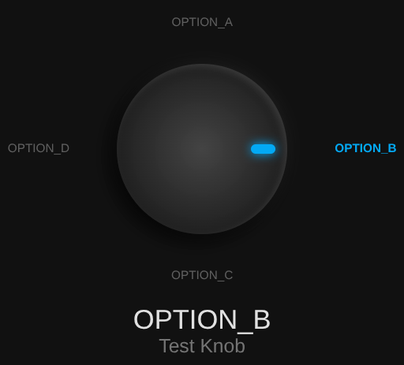
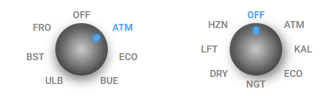

# Rotary Knob Card für Home Assistant

[🇬🇧 English](README.md) | [🇩🇪 **Deutsch**](README.de.md)

[](https://www.home-assistant.io/)
[](https://hacs.xyz)
[](https://opensource.org/licenses/MIT)
[](https://nodejs.org/)
[](https://github.com/fstancu/rotary_knob_card/actions/workflows/ci.yml)

Eine schöne, taktile Drehknopf-Dashboard-Karte für Home Assistant. Sie zeichnet
ein neumophoristisches Rädchen, das sich dreht, um die aktuelle Option einer
`input_select`- oder `select`-Entität widerzuspiegeln, und lässt den Benutzer
durch einen Klick eine andere Option auswählen.

Die Karte unterstützt Standard-Home-Assistant-Card-Actions: `tap_action`,
`hold_action` und `double_tap_action`.





## Funktionen

- **Intuitive Bedienung**: Klicke auf den Knopf, um durch `input_select`-Optionen zu wechseln.
- **Glatte Animation**: Die visuelle Drehung entspricht dem aktuellen Entitätszustand.
- **Neumophorisches Design**: Modernes dunkles Ästhetik, das Home Assistant perfekt ergänzt.
- **Gestenunterstützung**: Tap, Double-Tap und Langdruck-Aktionen.
- **Action-Routing**: Konfigurierbare `tap_action`, `hold_action` und
  `double_tap_action` gemäß der HA Card Action Konvention.
- **Sicherheitsfokussiert**: Alle Konfigurationswerte werden HTML/CSS-escaped;
  Service-Aufrufe werden gedrosselt, um Überflutung zu verhindern; URL-Aktionen
  sind auf `http:` und `https:`-Protokolle beschränkt.
- **Keine Abhängigkeiten**: Reines Custom Element - kein Framework erforderlich.

## Installation

### Über HACS

1. Öffne **HACS** in deiner Home Assistant-Instanz.
2. Klicke auf die **drei Punkte (⋮)** → **Custom repositories**.
3. Füge `https://github.com/fstancu/rotary_knob_card` hinzu.
4. Wähle **Dashboard** als Kategorie und klicke auf **Add**.
5. Suche in der HACS-Bibliothek nach **Rotary Knob Card** und klicke auf **Download**.
6. **Starte Home Assistant neu.**

### Manuelle Installation

Lade `rotary_knob_card.js` in deinen `www`-Ordner (oder `config/www`) herunter
und registriere sie als Lovelace-Resource.

**Über die Benutzeroberfläche (empfohlen):**
- **Einstellungen → Dashboards → Drei Punkte (⋮) → Ressourcen → Ressource hinzufügen**
- URL: `/local/rotary_knob_card.js`
- Modul-Typ: `JavaScript Module`

**Über `configuration.yaml`:**

```yaml
lovelace:
  resources:
    - url: /local/rotary_knob_card.js
      type: module
```

Starte danach Home Assistant neu.

## Verwendung

Füge eine **Manuelle Karte** zu deinem Dashboard hinzu:

```yaml
type: custom:rotary-knob-card
entity: input_select.wohnzimmer_modus
name: "Wohnzimmer"
```

## Konfiguration

| Option                   | Typ      | Standard                    | Beschreibung                                                             |
| ------------------------ | -------- | --------------------------- | ------------------------------------------------------------------------ |
| `entity`                 | string   | -                           | **Erforderlich.** `input_select` oder `select` Entity-ID.                |
| `name`                   | string   | `"Rotary Control"`          | Text unter dem Status-Label.                                             |
| `knob_size`              | number   | `140`                       | Durchmesser des Knopfes in px.                                           |
| `label_gap`              | number   | `34`                        | Abstand vom Knopfrand zum Beschriftungsring.                             |
| `label_max_width`        | number   | `92`                        | Maximale Breite pro Optionsbeschriftung vorZeilenumbruch.                |
| `padding`                | number   | `24`                        | Innenabstand um den Karteninhalt.                                        |
| `label_font_size`        | number   | `12`                        | Schriftgröße der Beschriftungen um den Knopf.                            |
| `state_font_size`        | number   | `22`                        | Schriftgröße des aktuellen Status.                                       |
| `name_font_size`         | number   | `16`                        | Schriftgröße des Namens-Untertitels.                                     |
| `text_color`             | string   | `var(--primary-text-color)` | Textfarbe für Beschriftungen, Status und Namen.                          |
| `accent_color`           | string   | `#03A9F4`                   | Akzentfarbe für Indikator, aktive Labels, Hover.                         |
| `knob_color`             | string   | `#444`                      | Hintergrundfarbe des Knopfkörpers.                                       |
| `show_position_markers`  | boolean  | `true`                      | Positionsmarkierungen um den Knopf anzeigen.                             |
| `marker_distance`        | number   | `18`                        | Abstand vom Knopfrand zu den Positionsmarkierungen.                      |
| `show_labels`            | boolean  | `true`                      | Beschriftungsring um den Knopf anzeigen.                                 |
| `show_state`             | boolean  | `true`                      | Aktuellen Status unter dem Knopf anzeigen.                               |
| `show_name`              | boolean  | `true`                      | Namen-Untertitel unter dem Status anzeigen.                              |
| `tap_action`             | object   | -                           | Aktion beim Einfach-Tap (ohne `double_tap_action`).                      |
| `hold_action`            | object   | -                           | Aktion beim Langdruck.                                                   |
| `double_tap_action`      | object   | -                           | Aktion beim Doppel-Tap. Ohne sie wird ein Tap sofort ausgelöst.          |
| `debug`                  | boolean  | `false`                     | Aktiviert Debug-Logging in der Browser-Konsole.                        |
| `labels``                 | list     | -                           | Benutzerdefinierte Beschriftungen für Optionen (1:1 zugeordnet).         |

### Beispiele

Kompakte Karte:

```yaml
type: custom:rotary-knob-card
entity: input_select.heizungs_status
name: "Heizung"
knob_size: 80
label_gap: 18
padding: 10
```

Minimal (nur Knopf, keine Beschriftungen oder Texte):

```yaml
type: custom:rotary-knob-card
entity: input_select.heizungs_status
show_labels: false
show_state: false
show_name: false
```

Benutzerdefinierte Beschriftungen:

```yaml
type: custom:rotary-knob-card
entity: input_select.heizungs_status
name: "Heizung"
labels:
  - "Aus"
  - "Eco"
  - "Komfort"
```

Individuelles Styling:

```yaml
type: custom:rotary-knob-card
entity: input_select.heizungs_status
name: "Heizung"
label_font_size: 15
state_font_size: 24
name_font_size: 18
text_color: "#f5f5f5"
accent_color: "#ffb347"
knob_color: "#5a3d2b"
show_position_markers: true
marker_distance: 20
```

### Card Actions

Aktionen folgen der [Home Assistant Card Action Konvention](https://github.com/home-assistant/frontend/blob/dev/docs/development/contract-card.md#action):

```yaml
type: custom:rotary-knob-card
entity: input_select.wohnzimmer_modus
tap_action:
  action: perform-action
  perform_action: light.toggle
  data:
    entity_id: light.wohnzimmer
hold_action:
  action: more-info
double_tap_action:
  action: navigate
  navigation_path: /lovelace/wohnzimmer
```

- Wenn `double_tap_action` festgelegt ist, wird ein einfacher Tap um
  `DOUBLE_TAP_MS` (≈300 ms) verzögert, um einen zweiten Tap zu erkennen.
- `hold_action` unterdrückt den Tap, wenn die Langdruck-Schwelle überschritten wird.
- **Timing:** `LONG_PRESS_MS` = 500 ms (Langdruck), `DOUBLE_TAP_MS` = 300 ms
  (Doppel-Tap-Erkennung).
- **Touch-Unterstützung:** Gesten basieren auf Pointer Events; `touch-action: manipulation`
  verhindert Zoom beim Doppel-Tap.
- **Tastaturunterstützung:** Drücke <kbd>Enter</kbd> oder <kbd>Space</kbd>,
  um die `tap_action` auszulösen.
- **Sicherheit:** URL-Aktionen sind auf `http:` und `https:`-Protokolle beschränkt;
  alle Konfigurationswerte werden HTML/CSS-escaped.

## Entwicklung

### Einrichtung

```powershell
# Abhängigkeiten installieren
npm ci

# Lint
npm run lint

# Tests ausführen
npm test

# Watch-Modus
npm run test:watch

# Coverage (deaktiviert wegen new Function()-Lade-Muster)
npm run coverage
```

### Pre-Commit Hook

Ein Git-Pre-Commit-Hook (Husky) führt `lint-staged` (ESLint --fix für
gestagene Dateien) sowie `npm run lint` und `npm test` vor jedem Commit aus.

## Screenshots


*(TODO: Füge echte Screenshots hinzu)*

## Lizenz

MIT License - siehe [LICENSE](LICENSE).

## Repository

[https://github.com/fstancu/rotary_knob_card](https://github.com/fstancu/rotary_knob_card)
